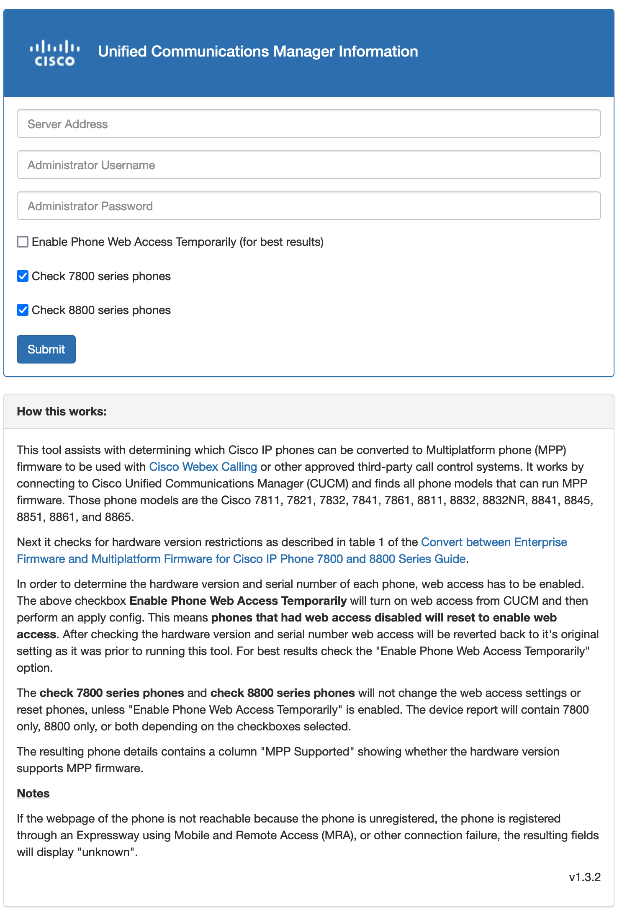
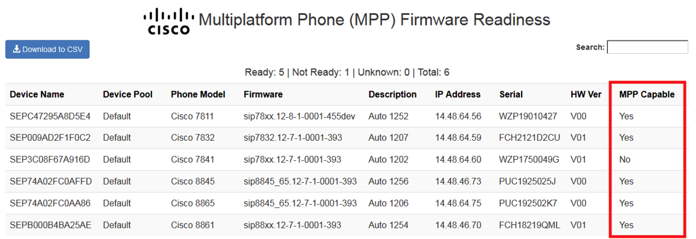

# Cisco IP Phone Readiness Tool To Check For Webex Calling (WxC) Compatible IP Phones 

## Problem

Not all Cisco IP Phones can run Multiplatform phone (MPP) firmware which is required to be used with Webex Calling. Phone compatibility is based on the phone model and the hardware version. For customers with Cisco IP Phones using Cisco Unified Communications Manager (CUCM) the phones run Enterprise firmware and must be converted to MPP firmware to be used with Webex Calling.
There was no easy way to determine the hardware version of your IP phones. We document here to check the sticker on the back of each phone to find the hardware version. Clearly this does not scale, takes too long, and requires physical access to the phones.

On Cisco Unified Communications Manager (CUCM) create a phone service from Device > Device Settings > Phone Services.  Provide a "Service Name" such as "CER Audit" and set the "Service URL" to point to "http://<flask server>:<optional port>/cerlocationaudit/<cluster id>".  The cluster ID is should match the cer_cluster_name so that the tool knows which CER cluster is associated with which CUCM cluster.  Optionally select "Enterprise Subscription" so that every phone will have this service available without having to subscribe phones to the service.  Also ensure the "enabled" checkbox is selected.

## Solution
There is now a standalone executable tool that can be given to customers that automates the hardware version retrieval proces -> [DOWNLOAD](https://github.com/joemar2/mpp_readiness_check/tree/master/executables).

This tool assists with determining which Cisco IP phones can be converted to Multiplatform phone (MPP) firmware to be used with Cisco Webex Calling or other approved third-party call control systems. It works by connecting to Cisco Unified Communications Manager (CUCM) and finds all phone models that can run MPP firmware. Those phone models are the Cisco 7811, 7821, 7832, 7841, 7861, 8811, 8832, 8841, 8845, 8851, 8851NR, 8861, and 8865.
Next it checks for hardware version restrictions as described in table 1 of the Convert between Enterprise Firmware and Multiplatform Firmware for Cisco IP Phone 7800 and 8800 Seri....
In order to determine the hardware version and serial number of each phone, web access has to be enabled. The above checkbox Enable Phone Web Access Temporarily will turn on web access from CUCM and then perform an apply config. This means phones that had web access disabled will reset to enable web access. After checking the hardware version and serial number web access will be reverted back to it's original setting as it was prior to running this tool. For best results check the "Enable Phone Web Access Temporarily" option.
The resulting phone details contains a column "MPP Supported" showing whether the hardware version supports MPP firmware.

## Notes
- If the webpage of the phone is not reachable because the phone is unregistered, the phone is registered through an Expressway using Mobile and Remote Access (MRA), or other connection failure, the resulting fields will display "unknown".

- CUCM user permissions for the account used with this tool requires "Standard AXL API Access". The standard AXL API Users role will not work as it is read only.

## Disclaimer
Support for this tool is provided on a best effort basis by the creator and contributors.

## Contribution
mpp_readiness_check is a community developed project. Code contributions are welcome via PRs!
Copyright (c) 2018-2022 Cisco and/or its affiliates.